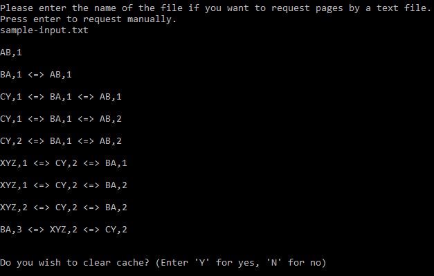
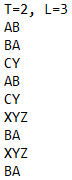
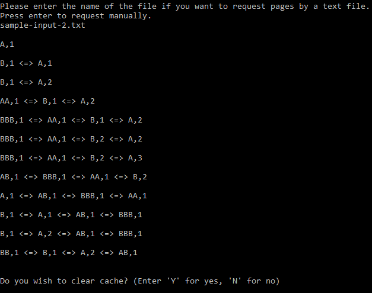
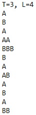

# Cache Buffer Simulation

Implementation of a cache buffer simulation by doubly linked list. Programmed in C.

### What Does the Program Do

  1. Reads the requests:
      * User can enter manually or program reads from a text file line by line.

  2. Processes the request:
      * If request does not exist in the cache buffer, it will be created as a new node.
      * If request already exists in the cache buffer, increases count of related node.
      * If request does not exist in the cache buffer and it's count is over threshold value (T), this node will be moved to head.    

  3. Maintains the cache buffer:
      * Cache buffer has a capacity (Length)(L). If node count is over the capacity, less significant node (tail node) will be deleted.
      
  4. Prints current status:
      * If user enters the requests manually, system prints the current status after each request enterance.
      * If requests read by file, system prints the final status.
      
  5. Clears cache:
      * At the end of the program, system asks if user wants to clear cache. If user wants, system clears cache.
      
### Screenshots
 

 
